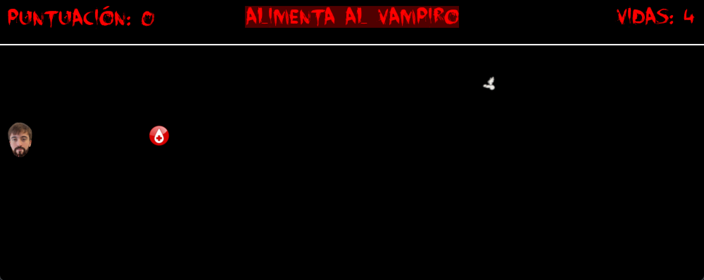

# Juego_Halloween
Creación de juego en Phyton para Halloween

# Table of Contents
1. [General Info](#general-info)
2. [Technologies](#technologies)
3. [Installation](#installation)
4. [Collaboration](#collaboration)
5. [FAQs](#faqs)
## General Info
***
Desarrollo de un juego simple en **Phyton**, utilizando la librería **Pygame**.
El juego consiste en ir cogiendo un elemento, el cual, cuantos más atrapes, más rápido se desplazará por la pantalla y más difícil será.

También habrá que tener cuidado con un elemento secundario el cual habrá que esquivar y sale de manera aleatoria :fire:.

El movimiento de los elementos es lineal sobre el eje X mientras que el jugador se desplazará en el eje Y, utilizando las flechas arriba y abajo solamente.

Resultado:
:white_check_mark: Proyecto terminado :white_check_mark:
## Screenshot
***
* Pantalla inicial de entrada al juego. Incluye instrucciones y explicación de los elementos del juego


***

* Pantalla de juego. Se incorpora un banner de información en la parte superior y se muestras los 3 elementos que componen el juego.




## Technologies
***
* [Python](https://es.python.org/): _Version 3.9_
* [Pygame](https://www.pygame.org/news): _Version 2.5.2_

## Installation
***
Descarga el archivo completo con todos sus recursos y colócalo en una carpeta a tu elección.

Utilizando cualquier compilador, navega hasta la ubicación del archivo alimenta_al_vampiro.py y estando este ubicado con el resto de recursos, lánzalo.
```bash
alimenta_al_vampiro.py
```
Se recomienda utiliza **PyCharm**


## Collaboration
***
Agradecimiento especiales a los siguientes desarrolladores, por sus aportaciones, nuevos puntos de vista y correcciones:

* [Yolanda Tain Gutierrez](https://github.com/YolandaTain)

* [José Miguel Cordon Fioris](https://github.com/josemicordon)
## FAQs
***
Listado de preguntas frecuentes
1. **¿Puedo modificar la dificultad?**

No, esta aumenta de manera automática, paulatinamente, a medida que consigues coger más sangre.

2. **¿Puedo aumentar mis vidas?**

No, las vidas iniciales son 5 y no hay forma de aumentar la cantidad ni de recuperarlas una vez perdidas durante la partida.

3. **¿Es ilimitado el juego?**

No :loop:, el juego tiene un **score** máximo al que se puede llegar, incluyendo una sorpresa en ese caso.

4. **¿Hay algo escondido?**

Si, te animo a que pruebes a alcanzar la puntuación máxima, a que **mueras** de diferentes formas...:monkey_face: puede haber sorpresas.

5. **¿Es mi vampiro vegano?**

Eso depende de ti, tu decides que quieres comerte durante la partida :smirk:

