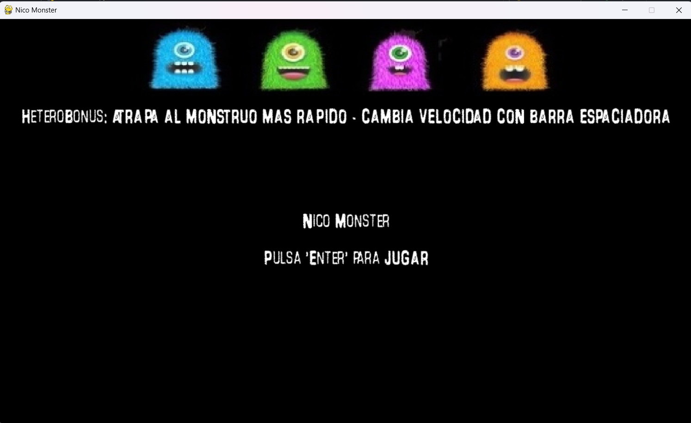
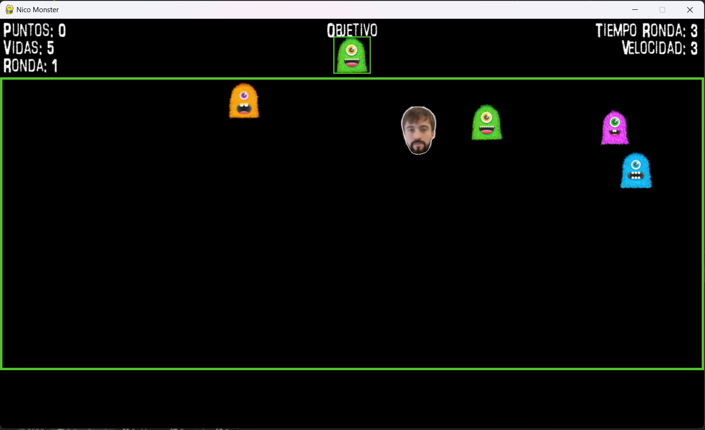
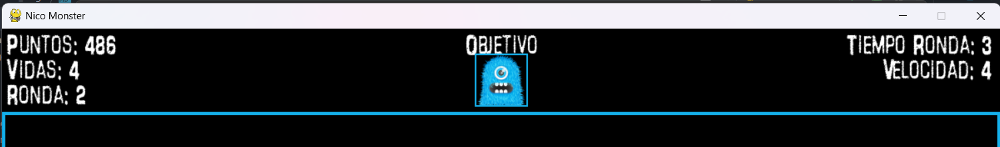

# Juego_Halloween
Creación de juego en Python para Halloween

# Table of Contents
1. [General Info](#general-info)
2. [Technologies](#technologies)
3. [Installation](#installation)
4. [Collaboration](#collaboration)
5. [FAQs](#faqs)
## General Info
***
Desarrollo de un juego en **Python**, utilizando la librería **Pygame**.
El juego consiste en atrapar un objetivo concreto, en este caso un monstruo de un color específico. 
Al subir de nivel o siguiente ronda el juego aumenta de velocidad y aparecen más monstruos en la pantalla lo cual lo hace más difícil. 
Puedes switchear de nivel de velocidad con la barra espaciadora para subir o bajar el nivel de dificultad del juego. 

El movimiento del jugador se realiza con las fechas para ir de arriba a abajo y de izquierda a derecha. 
El movimiento, color y velocidad de cada monstruo es aleatoria usando el métoodo Random.randint()

Resultado:
:white_check_mark: Proyecto terminado :white_check_mark:
## Screenshot
***
* Pantalla inicial de entrada al juego. Incluye instrucciones y explicación de los elementos del juego





***

* Pantalla de juego. Se incorpora una interfaz o HUB de información en la parte superior y se muestra la puntuación, velocidad, tiempo, ronda. 
El tiempo es importante ya que existe un bonus si el jugador completa la ronda más rápido. 




## Technologies
***
* [Python](https://es.python.org/): _Version 3.9_
* [Pygame](https://www.pygame.org/news): _Version 2.5.2_

## Installation
***
Descarga el archivo completo con todos sus recursos y colócalo en una carpeta a tu elección.

Utilizando cualquier compilador, navega hasta la ubicación del archivo nico_monster.py y estando este ubicado con el resto de recursos, lánzalo.
```bash
nico_monster.py
```
Se recomienda utiliza **PyCharm** 


## Collaboration
***
Agradecimiento especiales a los siguientes desarrolladores, por sus aportaciones, nuevos puntos de vista y correcciones:

* [Jorge Marimon](https://github.com/JorgeMarimon)

* [José Miguel Cordon Fioris](https://github.com/josemicordon)
## FAQs
***
Listado de preguntas frecuentes
1. **¿Puedo modificar la dificultad?**

Sí, con la barra espaciadora modificas la velocidad del juego. 

2. **¿Puedo aumentar mis vidas?**

No, las vidas iniciales son 5 y no hay forma de aumentar la cantidad ni de recuperarlas una vez perdidas durante la partida.

3. **¿Es ilimitado el juego?**

Sí, como la vida misma.

4. **¿Motiva ser el más Hetero?**

Eso depende de tu nivel de masculinidad.


